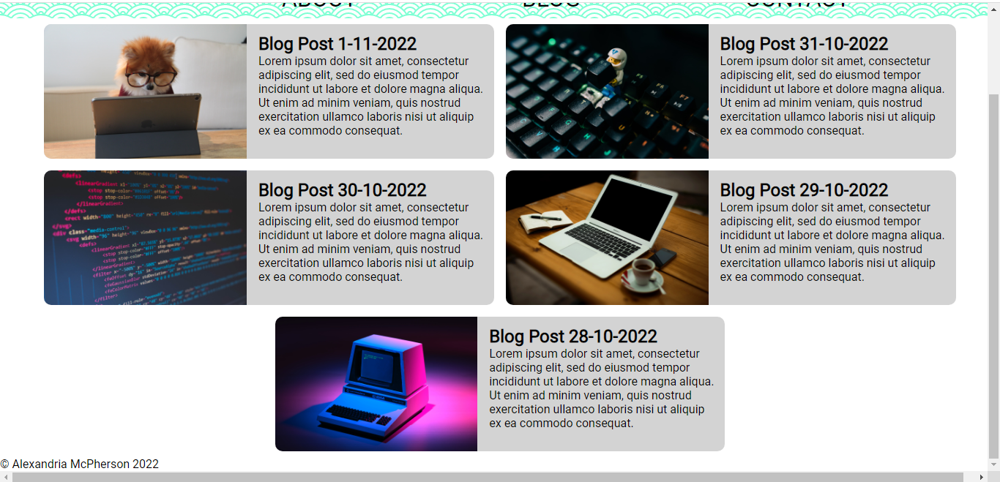

# Links

[Portfolio Site](https://www.alexandria-toshokan.com/T1A2/index.html)

[GitHub Repo](https://github.com/radiantbutterfly/portfolio)

[Presentation Video](https://youtu.be/J7Z_yIzvnoU)

# Description

## Purpose

The purpose of this site is to provide potential employers with background information about myself and provide a space to display my future work as a web-developer.

## Functionality and features

The site features:
- A navbar for navigating the site.
- An index page with an animation and a short blurb about myself.
- An about page with a photo of myself, link to resume pdf and a timeline.
- A blog page with previews of and links to five blog entries.
- A contact form for sending messages.
- Social icons with links to my LinkedIn and GitHub profiles.

# Sitemap

# Screenshots

# Target Audience

The target audience of this site is potential employers with technical knowledge relating to website development, information technology, programming languages and development stacks and software development. They would also be seeking hardworking staff with a professional attitude.

# Tech Stack

This project is built with HTML and CSS and is deployed on webhosting provided by DreamHost.

# Citations
## Images
### Circular LinkedIn Icon
LinkedIn (2014). *LinkedIn icon circle*. [online] Wikimedia Commons. Available at: https://commons.wikimedia.org/wiki/File:LinkedIn_icon_circle.svg. [Accessed 31 Oct. 2022]

### Circular GitHub Logo
GitHub. (n.d.). *Build software better, together*. [online] Available at: https://github.com/logos. [Accessed 31 Oct. 2022]

### Navbar Background 
‌heropatterns.com. (n.d.). *Hero Patterns | Free repeatable SVG background patterns for your web projects.* [online] Available at: https://heropatterns.com/. [Accessed 31 Oct. 2022]

### Navbar logo
PNGitem.com. (n.d.). *Family Crest Called Chidori - Birds Japanese Family Crest, HD Png Download , Transparent Png Image - PNGitem*. [online] Available at: https://www.pngitem.com/middle/ibRmwwT_family-crest-called-chidori-birds-japanese-family-crest/ [Accessed 31 Oct. 2022].

### Blog Photos
Alejandro Escamilla (n.d.). *Photo by Alejandro Escamilla on Unsplash*. [online] unsplash.com. Available at: https://unsplash.com/photos/N7XodRrbzS0 [Accessed 31 Oct. 2022].

Cookie the Pom (n.d.). *Photo by Cookie the Pom on Unsplash*. [online] unsplash.com. Available at: https://unsplash.com/photos/gySMaocSdqs [Accessed 31 Oct. 2022].

Florian Olivo (n.d.). *Photo by Florian Olivo on Unsplash*. [online] unsplash.com. Available at: https://unsplash.com/photos/4hbJ-eymZ1o. [Accessed 31 Oct. 2022].

Ken Suarez (n.d.). *Photo by Ken Suarez on Unsplash*. [online] unsplash.com. Available at: https://unsplash.com/photos/4IxPVkFGJGI [Accessed 31 Oct. 2022].

Lorenzo Herrera (n.d.). *Photo by Lorenzo Herrera on Unsplash*. [online] unsplash.com. Available at: https://unsplash.com/photos/yP89apz2TAA [Accessed 31 Oct. 2022].

## Code
9elements.github.io. (n.d.). *Fancy Border Radius Generator*. [online] Available at: https://9elements.github.io/fancy-border-radius/ [Accessed 1 Nov. 2022].

CSS Gradient. (2017). *CSS Gradient — Generator, Maker, and Background*. [online] Available at: https://cssgradient.io/. [Accessed 1 Nov. 2022]

Hansen, D. (2013). *SVG Circle/Ellipse to Path Converter*. [online] ComplexDan. Available at: http://complexdan.com/svg-circleellipse-to-path-converter/ [Accessed 1 Nov. 2022].

www.w3docs.com. (n.d.). *How to Remove and Style the Border Around Text Input Boxes in Google Chrome*. [online] Available at: https://www.w3docs.com/snippets/css/how-to-remove-and-style-the-border-outline-around-text-input-boxes-in-google-chrome.html [Accessed 1 Nov. 2022].

‌